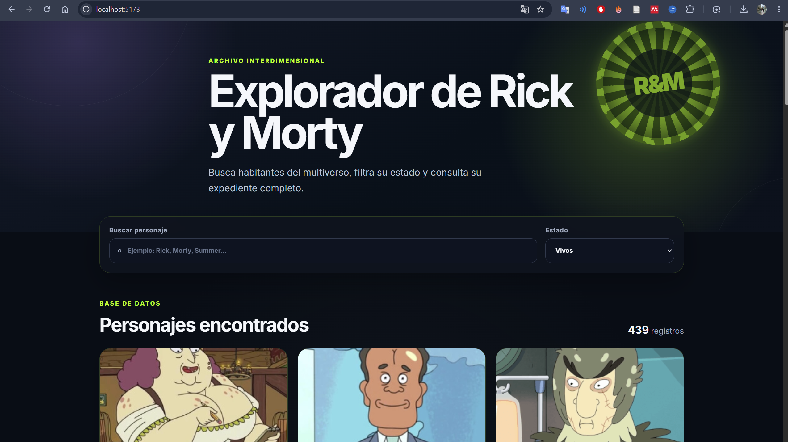
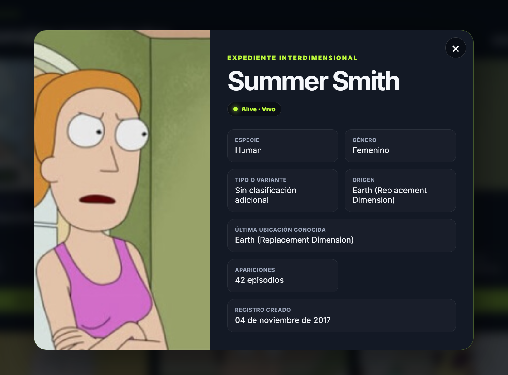

Holi Inggg. Esta es una aplicación web desarrollada con React que permite consultar, buscar, filtrar y visualizar información de los personajes de la serie Rick y Morty mediante el consumo de una API REST.


Rick y Morty obtiene información directamente desde la API pública de Rick and Morty:
https://rickandmortyapi.com/api/character


La aplicación permite:

* Mostrar un listado de personajes.
* Visualizar la imagen, nombre, estado, especie y género de cada personaje.
* Buscar personajes por nombre.
* Filtrar personajes por estado: Alive, Dead o Unknown.
* Navegar entre las diferentes páginas de resultados.
* Mostrar un indicador mientras los datos se están cargando.
* Informar al usuario cuando ocurre un error.
* Mostrar un mensaje cuando una búsqueda no tiene resultados.
* Consultar información adicional al seleccionar un personaje.
* Adaptarse a computadoras, tabletas y teléfonos.

Se utilizó:

* React
* JavaScript
* Vite
* HTML5
* CSS3
* Fetch API
* Rick and Morty API
* Git
* GitHub

La aplicación fue desarrollada utilizando React y se encuentra dividida en componentes independientes y reutilizables.

El componente principal se renderiza desde el archivo:

```jsx
createRoot(document.getElementById('root')).render(
  <StrictMode>
    <App />
  </StrictMode>,
);
```

### Uso de 'useState'

El hook 'useState' se utiliza para almacenar y actualizar información que cambia durante el uso de la aplicación.

En 'App.jsx' se controlan los siguientes estados:

```jsx
const [searchTerm, setSearchTerm] = useState('');
const [statusFilter, setStatusFilter] = useState('');
const [currentPage, setCurrentPage] = useState(1);
const [selectedCharacter, setSelectedCharacter] = useState(null);
const [requestVersion, setRequestVersion] = useState(0);
```

Cada estado tiene una función específica:

* `searchTerm`: guarda el texto ingresado en el buscador.
* `statusFilter`: guarda el estado seleccionado.
* `currentPage`: controla la página actual.
* `selectedCharacter`: almacena el personaje seleccionado.
* `requestVersion`: permite repetir una consulta cuando ocurre un error.

También se utiliza `useState` dentro del custom hook `useCharacters`:

```jsx
const [characters, setCharacters] = useState([]);
const [pageInfo, setPageInfo] = useState(INITIAL_INFO);
const [isLoading, setIsLoading] = useState(true);
const [error, setError] = useState('');
```

Estos estados permiten controlar los personajes obtenidos, la paginación, el indicador de carga y los posibles errores.

### Uso de `useEffect`
Se utiliza para realizar la consulta a la API cuando cambia la página, el nombre buscado, el estado seleccionado o el valor de reintento.

```jsx
useEffect(() => {
  const controller = new AbortController();

  async function loadCharacters() {
    setIsLoading(true);
    setError('');

    try {
      const data = await getCharacters({
        page,
        name,
        status,
        signal: controller.signal,
      });

      setCharacters(data.results);
      setPageInfo(data.info);
    } catch (requestError) {
      if (requestError.name !== 'AbortError') {
        setCharacters([]);
        setPageInfo(INITIAL_INFO);
        setError(
          'No fue posible cargar los personajes. Revisa tu conexión e inténtalo nuevamente.',
        );
      }
    } finally {
      if (!controller.signal.aborted) {
        setIsLoading(false);
      }
    }
  }

  loadCharacters();

  return () => controller.abort();
}, [page, name, status, requestVersion]);
```

Las dependencias del efecto son:

```jsx
[page, name, status, requestVersion]
```

Esto significa que la consulta se vuelve a ejecutar cuando cambia alguno de esos valores.

También se utiliza 'useEffect' en el hook 'useDebounce', que espera unos milisegundos antes de realizar la búsqueda:

```jsx
useEffect(() => {
  const timerId = window.setTimeout(() => {
    setDebouncedValue(value);
  }, delay);

  return () => window.clearTimeout(timerId);
}, [value, delay]);
```

### Consumo directo de la API

La aplicación no utiliza personajes escritos manualmente ni información estática. La consulta se realiza en el archivo:
src/services/characterService.js

Ejemplo:
```jsx
const response = await fetch(
  `https://rickandmortyapi.com/api/character?${params.toString()}`,
  { signal },
);
```

Los parámetros de búsqueda se construyen dinámicamente:

```jsx
const params = new URLSearchParams({
  page: String(page),
});

if (name.trim()) {
  params.set('name', name.trim());
}

if (status) {
  params.set('status', status);
}
```

De esta manera, los personajes siempre se obtienen directamente desde la API proporcionada.

La información mostrada depende completamente de la respuesta recibida desde la API REST.

El arreglo comienza vacío:

```jsx
const [characters, setCharacters] = useState([]);
```

Posteriormente se actualiza con la respuesta de la API:

```jsx
setCharacters(data.results);
```

### Responsabilidad única de los componentes

Estas son las funciones de los componentes:

Header: muestra el encabezado y la presentación de la aplicación.

SearchBar: contiene el campo para buscar personajes por nombre.

StatusFilter: permite filtrar los personajes por su estado.

CharacterGrid: organiza y muestra el listado de personajes.

CharacterCard: presenta la información principal de cada personaje.

CharacterModal: muestra información adicional del personaje seleccionado.

LoadingSpinner: presenta un indicador mientras se cargan los datos.

ErrorMessage: informa cuando ocurre un error y permite volver a intentar la consulta.

EmptyState: muestra un mensaje cuando no existen resultados.

Pagination: permite navegar entre las diferentes páginas de personajes.

useCharacters: administra la consulta de personajes, el estado de carga y los errores.

characterService: se encarga de realizar la comunicación directa con la API.

La lógica de obtención de datos también se separó en el custom hook:

```text
src/hooks/useCharacters.js
```

Mientras que la comunicación con la API se encuentra en:

```text
src/services/characterService.js
```

Esta separación facilita la lectura, mantenimiento y reutilización del código.

## Estructura del proyecto

```text
src/
├── components/
│   ├── CharacterCard.jsx
│   ├── CharacterGrid.jsx
│   ├── CharacterModal.jsx
│   ├── EmptyState.jsx
│   ├── ErrorMessage.jsx
│   ├── Header.jsx
│   ├── LoadingSpinner.jsx
│   ├── Pagination.jsx
│   ├── SearchBar.jsx
│   └── StatusFilter.jsx
├── hooks/
│   ├── useCharacters.js
│   └── useDebounce.js
├── services/
│   └── characterService.js
├── utils/
│   └── characterUtils.js
├── App.css
├── App.jsx
├── index.css
└── main.jsx
```

## Instalación y ejecución

Clonar el repositorio:

```bash
git clone https://github.com/TU-USUARIO/rick-and-morty-explorer.git
```

Entrar en la carpeta:

```bash
cd rick-and-morty-explorer
```

Instalar las dependencias:

```bash
npm install
```

Ejecutar el proyecto:

```bash
npm run dev
```

Abrir en el navegador la dirección que aparece en la terminal, normalmente:

```text
http://localhost:5173
```

## Capturas de pantalla

### Pantalla principal

Agregar aquí una captura del listado inicial de personajes.

```markdown

```

### Búsqueda por nombre

Agregar aquí una captura utilizando el buscador.

```markdown

```

### Filtro por estado

Agregar aquí una captura con el filtro Alive, Dead o Unknown.

```markdown

```

### Información adicional

Agregar aquí una captura del modal de detalle.

```markdown

```

## Repositorio de GitHub

Enlace del repositorio:

```text
https://github.com/TU-USUARIO/rick-and-morty-explorer
```

## Conclusiones personales

Durante el desarrollo de este taller pude comprender de una forma más práctica cómo funciona el consumo de una API REST dentro de una aplicación creada con React.

El hook `useState` me permitió administrar los valores que cambian durante la ejecución de la aplicación, como el texto del buscador, el filtro seleccionado, la página actual, el personaje seleccionado, los resultados, la carga y los errores.

y el hook `useEffect` para ejecutar la consulta a la API cada vez que cambiaban los filtros o la página. También comprendí la importancia de definir correctamente sus dependencias para evitar peticiones innecesarias o comportamientos inesperados.

La separación del proyecto en componentes ayuda a mantener el código más organizado y no tener todo mezclado, esto facilita la lectura, reutilización y mantenimiento del code.

Uno de los principales aprendizajes fue manejar diferentes estados de una petición, como la carga, el éxito, los resultados vacíos y los errores. Esto permite ofrecer una mejor experiencia al usuario y no limitar la aplicación únicamente a mostrar información cuando todo funciona correctamente.

